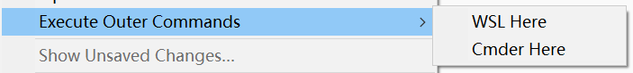

# dctxmenu (Dynamic Context Menu)
[dctxmenu](https://github.com/absop/dctxmenu)是一个 Sublime Text 插件，支持动态上下文菜单（右键菜单）。

通过修改设置文件，用户可以将**外部命令**绑定到右键菜单项或快捷键，从而通过鼠标右键或快捷键便捷地执行相应的外部命令。


# 安装
- 使用`git clone`将该仓库下载到你的（Sublime Text）插件安装目录（这需要你的电脑上装有Git工具）。
- 直接在 Github 网页上下载该仓库的压缩包，然后解压到你的（Sublime Text）插件安装目录，注意将目录名更改为 `dctxmenu`，且`dctxmenu`应直接包含插件代码文件，不要有多余嵌套，如下：
   ```
   dctxmenu
       Default.sublime-commands
       Default.sublime-keymap
       ExecuteOuterCommands.sublime-settings
       execute_outer_commands.py
       LICENSE
       Main.sublime-menu
       plugin.py
       README.md
       __init__.py
   ```


# 绑定右键菜单
你可以通过在命令面板中输入执行`Preferences: ExecuteOuterCommands Settins`命令，或点击主菜单 (Preferences>Package Settings>dctxmenu>Settings) 来开始编辑设置。

在设置中，你可以通过添加**命令配置**项来在右键菜单中增加一个**菜单子项**。

下面是一个例子
```json
{
    "caption": "Execute Outer Commands",

    "commands": [
        {
            "caption": "WSL Here",
            "command": ["ConEmu.exe", "/dir", "\"${file_path}\""],
        },
        {
            "caption": "Cmder Here",
            "command": ["Cmder.exe", "\"${file_path}\""]
        }
    ]
}
```

其中，`commands` 是一个**命令配置**列表。

每一个**命令配置**是一个词典（Dict，或 Map），其中的 `caption`为对应的命令在菜单中显示的标题，`command`为具体要执行的命令，请参考上面的例子认真填写。`command`可以是一个字符串，也可以是一个字符串的列表，`command`的字符串中可以包含一些变量（参考[Sublime Text API 文档](https://www.sublimetext.com/docs/api_reference.html#ver-dev)，搜索`extract_variables`），在执行命令时，这些变量会被替换为对应的值。

此外，命令配置还支持一个叫做`shell`的参数，其值为`bool`类型，这个参数默认为 `True`，被传递给`subprocess`，一般用不到。

`commands`中的一项直接对应一个菜单项。当有多个菜单项时，菜单会被折叠，折叠之后的菜单的标题为与`commands`同级的`caption`的值。而当`commands`中只有一项配置时，右键菜单中只会增加一个顶级菜单。

下图是上面的例子在右键菜单中增加的两个菜单子项


下面是另一个例子

- 设置
   ```json
   {
       "commands": [
           {
               "caption": "Cmder Here",
               "command": ["Cmder.exe", "\"${file_path}\""]
           }
       ]
   }
   ```

- 对应的菜单截图
   


# 绑定快捷键
你还可以将特定的外部命令绑定到快捷键（Preferences>Key Bindings），从而在Sublime Text中通过快捷键执行外部命令。下面是一个例子
```json
[
    {
        "keys": ["ctrl+alt+t"],
        "command": "execute_outer_commands",
        "args": {
            "command": ["Cmder.exe", "\"${file_path}\""],
            "shell": true
        }
    }
]
```
你可以复制该例子，然后修改 `"keys"`和`"args"`部分，`"args"`可以直接复制上面[绑定右键菜单](#绑定右键菜单)设置中的某个命令配置项（其中的`caption`会被忽略，不用在意）。


# 高级用法
在别的插件中注册使用`dctxmenu`的功能
```python
import dctxmenu

def plugin_loaded():
    def load_user_settings():
        plugin = ExecuteOuterCommandsCommand
        plugin.caption = settings.get('caption', 'Execute Outer Commands')
        plugin.commands = settings.get('commands', [])

    settings = sublime.load_settings(user_settings)
    settings.clear_on_change('caption')
    settings.add_on_change('caption', load_user_settings)

    load_user_settings()

    sublime.set_timeout(
        lambda: dctxmenu.register(__package__,
            ExecuteOuterCommandsCommand.make_menu),
        500
    )

def plugin_unloaded():
    dctxmenu.deregister(__package__)
```
别的插件可以通过注册一个菜单生成函数（如上面的`make_menu`）来使用`dctxmenu`的功能，
具体用法请阅读`dctxmenu`核心支持库的源码（本仓库下的`plugin.py`文件（80行）），并参考其使用示例：`execute_outer_commands.py`文件（本插件的功能部分，不到75行）。下面是另外一些例子

- [在线搜索](https://github.com/absop/SearchOnline)
- [打开其他文件](https://github.com/absop/OpenOtherFiles)
- [翻译器](https://github.com/absop/Translators)
